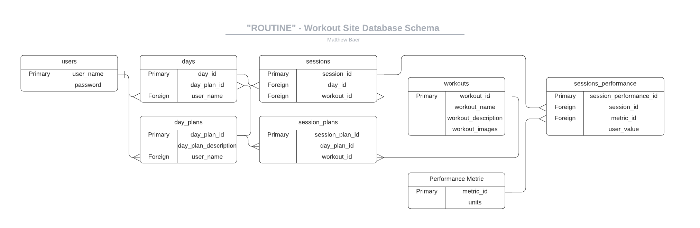

### Matthew Baer - Capstone Project Proposal

**Goal:**

_The goal of this site is to help users:_
- Plan exercises activities mapped to workouts
- Easily and unobtrusively manipulate pertinent data to record their performance
- View their performance over the course of multiple workouts to visualize their progress over time
 
 

**Demographic:**

- The site should provide the benefits of workout planning and progress tracking to novice to moderate hobbyist weight lifters and individuals interested in maintaining or growing their strength and muscular endurance.
 
 

**Data to be used:**
- Api to get workout suggestions: https://wger.de/en/software/api?ref=apilist.fun
- This should contain:
    - Workouts organized by muscle group
    - Suggested performance parameters (when applicable):
        - Weight (lifted during workout)
        - Sets
        - Reps
        - Time
    - User supplied:
        - User identification info:
            - Username
            - Password
            - Email
            - Image URL (Optional)
            - Bio (Optional)
    - User supplied data for performance (when applicable):
        - Weight (lifted during workout)
        - Sets completed
        - Reps completed
        - Time
 
 

**Outline of approach:**
- Database schema:
    - _See diagram:_

 
 

- API issues:
    - API downtime
    - API becoming no longer available
    - API not organizing information in way anticipated
    - API data is sparse / lacking appropriate detail
 
 

- Sensitive information:
    - Sensitive information will be username and encrypted password for user authentication and authorization.
 
 

- Functionality:
    - Represent basic workout information from API in legible format
    - Have a “guided” editor mode for use during a workout so that users can add data without being burdened by excessive navigation.
        - Example: “How many reps completed?”
        - Form Text Input: “15”
    - Have a “progress overview” for each workout that visually compares previous performance to most current performance.
 
 

- User Flow:
    - _See diagram B._ (forthcoming)
    - User:
        - Creates workouts > participates in workouts following plan > records performance metrics for each workout > views comparisions of past performance records for that workout.
 
 

- Features beyond CRUD:
    - Represent the user’s progress with a visual chart or graph likely using “chartjs” - tools or similar.
 
 

- Stretch Goals:
    - Integrate one api call that allows users to share their progress on a social media platform.
